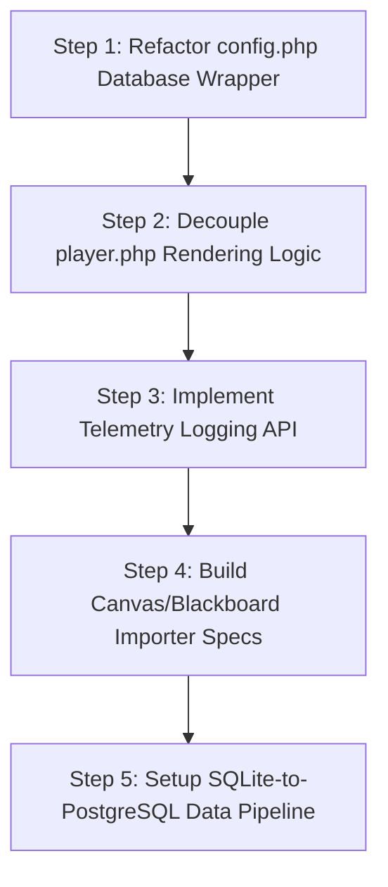

# 🧭 Superable LMOS Concepts and Roadmap — Architectural Advisory & Plan (v2)

This document provides a feasibility analysis, architectural evaluation, and execution plan to evolve the **Superable Learning LMS** from a multi-tenant course platform into a **Learning Management Operating System (LMOS)**. It defines the structural changes required in our codebase and recommends specific amendments to our current [ROADMAP.md](file:///C:/Users/jacob/projects/superablelearning.com/ROADMAP.md) to ensure we build for this future state without introducing premature complexity.

---

## 1. Feasibility Analysis & Architectural Advisory

### Feasibility Verdict: **Highly Feasible (with Modular Guardrails)**
The transition from a tenant-isolated LMS to a modular LMOS is highly achievable under the current architecture. The codebase is lightweight, has clear tenant isolation boundaries, and avoids heavy framework overhead (like Laravel or Symfony), making it easy to introduce microservices, custom endpoints, and custom content runners.

However, to support a scaling operating system environment, we must address three architectural bottlenecks:
1. **Monolithic Rendering in [player.php](file:///C:/Users/jacob/projects/superablelearning.com/player.php)**: The player blends session checks, content retrieval, layout building, and component loading in one PHP file. A headless browser (Puppeteer/Playwright) or external runtime will struggle to interface with this. We must decouple the rendering pipeline.
2. **Direct SQLite Dependency**: Directly executing raw SQLite queries makes migrating to a centralized database (like PostgreSQL) or routing queries to enterprise clusters extremely difficult.
3. **Lack of Event Queueing**: Heavy operations like course audits, package imports, and AI heuristics are currently synchronous, blocking PHP worker processes.

### SQLite vs. PostgreSQL: The Hybrid Database Strategy
The LMOS concepts guide notes a transition to **PostgreSQL** as a primary shared infrastructure. However, moving completely to a single, monolithic PostgreSQL database poses risks for the SMB-first, low-cost model. 

We propose a **Hybrid Database Architecture**:
*   **Tenant Data (SQLite)**: Keep the tenant-isolated SQLite files for core transactional data (individual user progress, tenant-specific settings, custom CSS). SQLite files are free, require zero server administration, and can be backed up or migrated individually.
*   **Orchestration & Analytics (PostgreSQL)**: Introduce PostgreSQL *only* at the LMOS layer (Phases 2-4) to run global services: cross-tenant compliance reports, global audit trails, institutional dashboards, and identity federation.
*   **Why this works**: SMB tenants remain cheap to host and manage. Enterprise tenants can be provisioned with standard SQLite databases for local operations, while their global metrics and compliance events are replicated to a central PostgreSQL node for processing.

---

## 2. Core Code Refactoring Plan
To make our existing files "LMOS-Ready" without making code changes yet, we should structure our future commits around the following targets:

### A. [config.php](file:///C:/Users/jacob/projects/superablelearning.com/config.php) (Database Abstraction & Tenant Hooking)
*   **Current State**: Instantiates SQLite connections directly via `new PDO('sqlite:...')`.
*   **Refactor Plan**:
    *   Introduce a database wrapper layer (e.g., a `DatabaseConnector` class) that handles connections.
    *   Expose generic database interfaces (`query`, `execute`, `prepare`) so that swapping SQLite for PostgreSQL (or routing logs to a separate system) requires modifying a single class, not every page.
    *   Add a central routing hook for microservices to resolve tenant database paths via secure API.

### B. [api.php](file:///C:/Users/jacob/projects/superablelearning.com/api.php) (RESTful Expansion & Telemetry Hooks)
*   **Current State**: Primarily handles `get_state` and `mark_complete` progress syncing.
*   **Refactor Plan**:
    *   Add endpoints for interaction logging (`action=log_telemetry`) to capture cognitive signals (pauses, error frequencies, speed) from the student player.
    *   Build standard JSON payloads representing user progress, allowing external runtimes to query student state.
    *   Implement basic API token/bearer authentication to authorize external services (Node.js/Python) to read/write state securely.

### C. [player.php](file:///C:/Users/jacob/projects/superablelearning.com/player.php) (Decoupled Rendering Architecture)
*   **Current State**: Renders HTML/JS interface directly on page request.
*   **Refactor Plan**:
    *   Transform the player into a single-page application (SPA) client shell.
    *   The PHP backend should act as a controller that simply resolves permissions, retrieves the `course_structure.json`, and outputs the raw data to a frontend JavaScript renderer.
    *   The frontend JS player (utilizing [jw-components.js](file:///C:/Users/jacob/projects/superablelearning.com/assets/components/jw-components.js)) will parse the JSON structure and build the DOM dynamically.
    *   **Why**: The Node.js rendering/WCAG service can now run the exact same JS player in a headless context with mock data to perform automated accessibility tests and capture screenshots.

---

## 3. Gaps in the Current Roadmap

The current [ROADMAP.md](file:///C:/Users/jacob/projects/superablelearning.com/ROADMAP.md) focuses primarily on SaaS tier monetization, feature-gating, basic role management, and simple UI components. To build for the LMOS, the following roadmap gaps must be filled:

1. **API-First Refactoring**: The roadmap does not plan for API endpoints for course configuration or student telemetry.
2. **Database Abstraction**: There is no task in the current roadmap to isolate raw SQL statements.
3. **Queue / Event Dispatcher**: Heavy automation (like automated WCAG scans) will lock up servers without a planned queue framework (Redis/RabbitMQ).
4. **Migration Interfaces**: Dislodging legacy LMS platforms (Canvas, Blackboard) requires planned course migration pipelines that normalize packages into LC-JSON.

---

## 4. Proposed Amendments to [ROADMAP.md](file:///C:/Users/jacob/projects/superablelearning.com/ROADMAP.md)

To prepare our roadmap for the future LMOS state, we will merge the SaaS platform features with the foundational requirements of the LMOS Kernel.

Below is the proposed revision for Phase 2 and Phase 3 of [ROADMAP.md](file:///C:/Users/jacob/projects/superablelearning.com/ROADMAP.md):

```markdown
## 🛠️ Phase 2: Core Platform & LMOS Foundation (Current & Mid-Term)
These tasks implement necessary SaaS billing and role controls while restructuring our system to become an LMOS-ready host.

### Architecture & LMOS Readiness
*   **Database Abstraction Layer**: Refactor raw PDO instances in `config.php` and `api.php` behind a database connector wrapper to allow SQLite-to-PostgreSQL routing in the future.
*   **API-First Endpoints**: Implement JSON API endpoints for user metadata, course structures, and progress logs to prepare for external Node.js/Python runners.
*   **Decouple Course Player**: Restructure `player.php` into a controller that outputs course JSON to a unified client-side rendering player, facilitating Puppeteer headless tests.
*   **Telemetry Buffer Endpoint**: Add an interaction tracking API endpoint (`api.php?action=log_interaction`) to buffer player telemetry in the SQLite databases for cognitive load heuristics.

### Sandbox (Free)
*   **Automatic Cleanup Routines**: Implement background cleanup script (cron-based) to purge inactive Sandbox assets.

### Pro ($10/mo)
*   **Billing & Subscription Enforcement**: Integrate Stripe webhook validation.
*   **Usage Logging**: Monitor active users and bandwidth.

### Premium ($20/mo)
*   **Role-Based Access Control (RBAC)**: Support Admin, Editor, and Viewer permissions, preparing for future institutional tenancy permissions.
*   **Shared Course Library**: Multi-admin workspace file synchronization.
*   **Advanced JSON Validation**: Upgrade `course_importer.php` with deep schema validation of LC-JSON packages.
*   **Component-Level Previews**: Contrast validation modal within the packager.
*   **LRS & xAPI integration**: Connect external Learning Record Stores.

### Accessibility & Interoperability Add-ons
*   **Modular Accessibility Audit Workflow**: Deliver review reports directly into the tenant dashboard.
*   **CSS Parser and Focus Ring Checks**: Ensure tenant Custom CSS injections do not override standard WCAG focus variables.
```

```markdown
## 🚀 Phase 3: LMOS Services & Enterprise Orchestration (Long-Term)
Strategic additions to establish the platform as a full-fledged Learning Management Operating System.

### Accessibility Kernel & Microservices
*   **Node.js Rendering Service**: Deploy Puppeteer/Playwright microservice to capture course screenshots, extract accessibility trees, and run WCAG audits.
*   **Python AI Service**: Introduce machine learning service for automated image analysis, alt-text generation, and reading complexity indexing.
*   **Event/Queue System Integration**: Deploy Redis queues to handle asynchronous auditing and ingestion tasks without blocking web workers.

### Cognitive Load Engine
*   **Interaction Data Processor**: Consume telemetry metrics (dwell time, navigation paths, pause intervals) to score student fatigue and cognitive burden.
*   **Adaptive Player Interface**: Enable dynamic content chunking and interface pacing based on cognitive heuristics.

### Migration & Interoperability
*   **LMS Migration Pipeline**: Support importing zip files from Canvas, Blackboard, and Moodle, converting course structures to LC-JSON on ingestion.
*   **Multi-Disability Accommodation Profile**: Introduce the "Accommodation Passport" enabling users to set system-wide preferences (Fatigue mode, Screen-reader focus mode, Motor accessibility mode).
```

---

## 5. Next Steps Plan

To move from this planning phase to code execution, we will execute the following steps sequentially:



1.  **Step 1: Refactor Database Connections** ([config.php](file:///C:/Users/jacob/projects/superablelearning.com/config.php)): Group direct database instantiations into a safe class, laying the groundwork for scaling options.
2.  **Step 2: Decouple the Player** ([player.php](file:///C:/Users/jacob/projects/superablelearning.com/player.php)): Move page rendering markup from backend PHP to a client-side layout parser, preparing for Puppeteer automation.
3.  **Step 3: Develop Telemetry Endpoints** ([api.php](file:///C:/Users/jacob/projects/superablelearning.com/api.php)): Add basic payload handlers for student activity events.
4.  **Step 4: Integrate the revised roadmap amendments** into [ROADMAP.md](file:///C:/Users/jacob/projects/superablelearning.com/ROADMAP.md) to set milestones.
